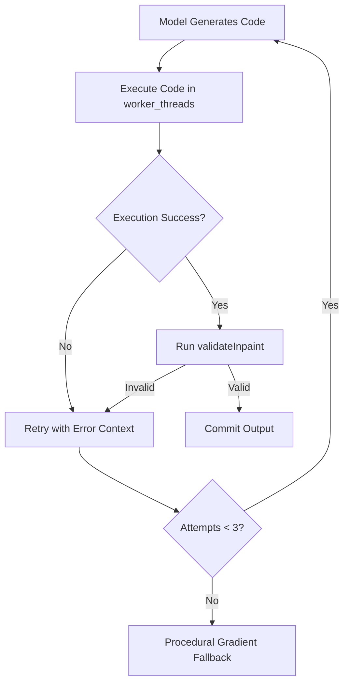

# Painter AI

A modern, browser-based painting application with first-class AI capabilities — featuring per-layer canvases, a global ⌘K controller, a streaming copilot panel, and a pluggable image-generation proxy.


---

## Features

### Canvas & Drawing Tools
- **12 Rich Tools:** Pointer, Select, Smart Select, Pencil, Brush, Eraser, Fill, Line, Rectangle, Ellipse, Text, and AI Brush.
- **Per-Layer Canvas Stack:** Every layer owns an independent `HTMLCanvasElement` with full visibility, opacity, and blend-mode controls.
- **Interactive Inpaint Selection:** Smart Select segments and bounds the clicked target automatically. The selection box features **8 resize handles** (corners + edge midpoints) for perfect canvas alignment.
- **State Controls:** Unlimited Undo and Redo stacks (`⌘Z` / `⌘⇧Z`), adjustable brush sizes via `[` / `]`, and window-blur guard that cleanly cancels active strokes if the window loses focus.

### Chat-Integrated AI Copilot
- **Context-aware ⌘K:** When a selection is active, pressing `⌘K` skips the CommandBar overlay and instead focuses the **Chat tab** input directly — Enter then fires a fast inpaint without a copilot round-trip. Without a selection, `⌘K` opens the CommandBar overlay for whole-canvas generation; the status bar's `⌘K` button always opens the CommandBar.
- **Chat input smart routing:** With an active selection, pressing `Enter` in the chat input calls `runInfill()` directly (inpaint, no copilot). Pressing `⌘/Ctrl+Enter`, or typing without a selection, routes through the copilot for a conversational response (which may itself produce an op-proposal card).
- **Proposals & History:** The Copilot streams rich text responses and **2×2 visual op-proposal cards** into the chat thread. Clicking a card commits that variation to the layer stack; others fade out. The History tab displays a chronological record of committed AI operations with 48px thumbnails.
- **Autonomy Modes:** Switch between *Propose* (requires review), *Auto-confident* (auto-commits high-confidence outputs), and *Agentic* (lets the agent generate and manipulate layer structures).
- **Settings overrides:** Per-session settings for AI providers, models, autonomy levels, default styles, variation count (1–4), and feather radius are stored locally.

### Floating Quick-Actions
When an active selection is made, a floating toolbar appears directly above it:
- **Generate / Prompt:** Activates focus on the Chat tab for custom prompt inpainting.
- **Remove:** Triggers seamless background fill using boundary colors.
- **Reimagine:** Generates fresh visual variations of the selected region.
- **Restyle:** Transforms the style of the selection using the default style configuration.
- **Re-run:** Replays the last executed prompt in chat history against the current (possibly resized) selection bounds.

### Project & Persistence
- **Autosave:** A 5-second debounced state snapshot is auto-saved to `localStorage` (storing layers as PNG data URLs).
- **File System Support:** Save and load projects locally in the custom `.paintai.json` (v1) format.
- **Export Options:** Export final composite artwork directly as PNG or high-quality JPG.
- **Canvas Presets:** 512², 1024², 1024×1536 (Portrait), and 1536×1024 (Landscape).

---

## Architecture

```
Frontend (Vite + React 18)             Proxy (Hono + Node)             Providers
───────────────────────────────  ──►  ──────────────────────────  ──►  ────────────────────────
editorStore (layers, selection)       GET  /ai/health                  mock (procedural fill)
chatStore   (messages, ops)           GET  /ai/status                  openai (gpt-image-1)
uiStore     (command bar focus)       POST /ai/chat (SSE)              codex-canvas (SDK)
settingsStore (autonomy, styles)      POST /ai/generate                cursor-canvas (SDK)
                                      POST /ai/segment                 gemini-canvas (CLI)
```

- **Frontend Seams:** To avoid dual-state inconsistencies, the client-side mock backend/copilot is disabled. The frontend always routes AI tasks to the server proxy.
- **Downstream Image Providers:** All image providers implement a unified interface: `generate(req) -> { variationsBase64, seeds }`.

| Provider | Integration Type | Authentication |
|---|---|---|
| `mock` | Server-side procedural gradient fill | Always ready; no keys required |
| `openai` | HTTPS integration to `gpt-image-1` | `OPENAI_API_KEY` |
| `codex-canvas` | Official `@openai/codex-sdk` integration | `CODEX_API_KEY` (Codex subscription) |
| `cursor-canvas` | `@cursor/sdk` `Agent.prompt()` integration | `CURSOR_API_KEY` |
| `gemini-canvas` | Native `gemini` CLI subprocess | `gemini` executable on `PATH` |

---

## AI Robustness System

To ensure a high success rate and eliminate silent failures, Painter AI executes canvas-code generations (written by Codex/Gemini models) through a robust, multi-stage pipeline:



1. **Sandboxed Execution:** Code is executed in a dedicated `node:worker_threads` Worker against a Cairo-backed canvas. Execution is strictly bounded by a 5-second timeout to prevent infinite loops from locking the main event loop.
2. **Output Validation:** The server runs `validateInpaint()` on the generated pixels and code. It verifies:
   - The presence of the required `draw(ctx, width, height)` function signature.
   - Active usage of canvas drawing APIs (`ctx.fillRect`, `ctx.arc`, etc.).
   - Non-blank and non-solid pixel buffers (unless the prompt specifically requests background removal/deletion).
3. **Automatic Error Feedback & Retry:** If validation fails or execution crashes, the server automatically starts a **retry loop (up to 3 attempts)**. The exact syntax or validation error details are appended to the next prompt, instructing the model to self-correct.
4. **Procedural Fallback:** If all 3 generation attempts fail, the server generates a fail-safe procedural gradient blending the surrounding edge colors inward.

---

## Getting Started

### Prerequisites
- Node.js 20+
- npm 10+
- A configured downstream provider for real AI operations (e.g. Gemini, OpenAI, or Codex).

### Install & Run

1. **Install Frontend Dependencies:**
   ```bash
   npm install
   ```

2. **Install Server Dependencies:**
   ```bash
   npm install --prefix server
   ```

3. **Configure Environment Variables:**
   ```bash
   cp server/.env.example server/.env
   # Open server/.env and add your API keys/model providers
   ```

4. **Start Development Servers (Vite + Proxy):**
   ```bash
   npm run dev
   ```
   * The Frontend will open at `http://localhost:5173`.
   * The Proxy server binds to `http://localhost:5174`.

*macOS shortcut: Double-click `start-dev.command` to automatically launch everything in a new Terminal window.*

### Build & Production
```bash
npm run build      # Runs TypeScript check and compiles production asset bundle -> dist/
npm run preview    # Serves the built production bundle locally
```

---

## Configuration

Set up environment variables in `server/.env`:

```env
# Chat Copilot & Codex SDK Settings
CODEX_API_KEY=
CODEX_MODEL=codex-mini-latest   # leave blank to use the SDK's own default

# Primary Image Generation Provider
# Options: mock | openai | codex-canvas | cursor-canvas | gemini-canvas
IMAGE_MODEL_PROVIDER=mock

# Downstream API Credentials
OPENAI_API_KEY=
CURSOR_API_KEY=
GEMINI_BIN=gemini
GEMINI_MODEL=gemini-2.5-pro

# Server Queue Settings (prevents downstream API rate-limits)
IMAGE_GENERATE_CONCURRENCY=1
IMAGE_GENERATE_QUEUE_MAX=2

# Port Configuration
PORT=5174
```

---

## Testing

Painter AI features a comprehensive Vitest suite covering canvas-code sandbox rendering, generate queues, persistence, and state handlers.

```bash
npm test             # Run all tests (76 passing)
npm run test:watch   # Start Vitest in interactive watch mode
npm run typecheck    # Run TypeScript compilation checks
npm run lint         # Run ESLint validation
```

---

## Known Issues

| Issue | Severity | Workaround & Details |
|---|---|---|
| **File > New freezes the tab** | High | Resetting a large project can block the renderer for 30+ seconds. Workaround: Reload the browser tab. |
| **Eraser keyboard shortcut unbound** | Low | The Eraser tool can be clicked in the Toolbox (▢ icon) but lacks a hotkey binding. |

---

## Project Structure

```
├── src/                  # React 18 Frontend
│   ├── ai/               # Server-bound copilot and backend seams (no local mock)
│   ├── components/       
│   │   ├── AIPanel/      # Chat, History, and Settings tabs
│   │   ├── Canvas/       # CanvasStage, selection overlays, and tools (pointer, pencil, brush, fill)
│   │   ├── CommandBar/   # ⌘K global controller
│   │   └── Shell/        # Header, Menubar, Statusbar
│   ├── state/            # Zustand stores (editorStore, chatStore, uiStore, settingsStore)
│   └── utils/            # Canvas manipulation utilities
├── server/               # Hono Proxy Server
│   ├── src/
│   │   ├── imageApi/     # downstream providers, Cairo workers, and validation logic
│   │   └── routes/       # generate, chat, segment, and health endpoints
├── tests/                # 76-test Vitest suite
└── docs/                 # Historical migration plans and assets
```
