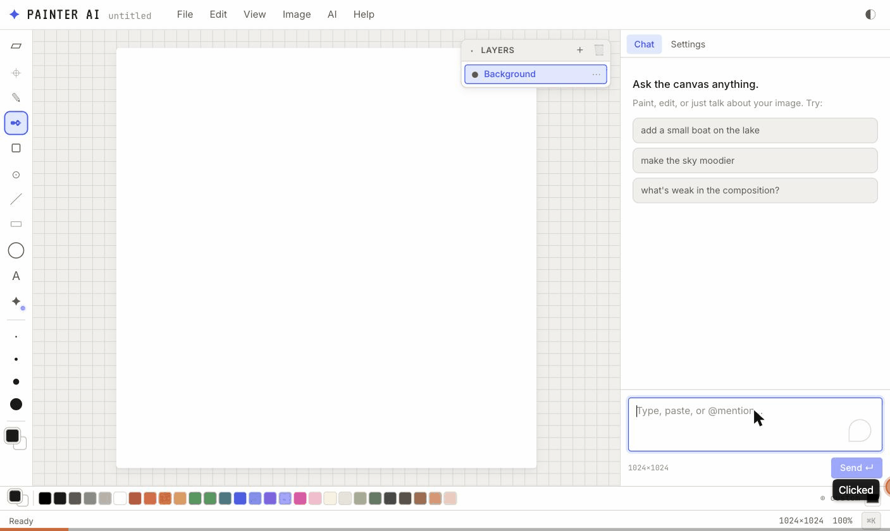

# Painter AI

A browser-based painting app with first-class AI affordances — per-layer canvases, a ⌘K command bar, a streaming copilot panel, and a pluggable image-generation backend that routes to OpenAI, Codex, Gemini, or Cursor.



---

## Features

### Canvas & tools
- **12 tools:** Pointer, Select, Smart Select, Pencil, Brush, Eraser, Fill, Line, Rectangle, Ellipse, Text, AI Brush
- Per-layer `<canvas>` stack — each layer owns its own `HTMLCanvasElement` with visibility, opacity, and blend-mode controls
- Smart Select places an inpaint region automatically around the clicked point; **8 resize handles** (corners + edge midpoints) let you adjust it after AI output lands
- Unlimited undo / redo (`⌘Z` / `⌘⇧Z`); brush size via `[` / `]`
- Window-blur guard cancels any in-progress stroke cleanly if the window loses focus

### AI panel
- **Chat tab** — streams text + op-proposal cards from the Codex copilot
- **History tab** — newest-first list of committed AI ops with 48 px thumbnails
- **Settings tab** — per-session overrides for provider, model, autonomy mode, default style, variation count (1–4), and feather radius; persisted in `localStorage`
- **Op proposal cards** — 2 × 2 variation grid in the chat thread; click to commit, others fade
- **Autonomy modes:** Propose (default), Auto-confident, Agentic
- **⌘K command bar** — global, context-aware; mode chip flips between Inpaint / Outpaint / New Layer based on active selection and references

### Floating quick-actions
When a selection is active, a toolbar appears above it:
- **Generate** — open inpaint with a free prompt
- **Remove** — seamless background fill
- **Reimagine** — inpaint variation of the region
- **Restyle** — restyle the region
- **Re-run** — replays the last inpaint/restyle prompt from chat history against the current (possibly resized) selection

### Project & persistence
- **Autosave** — 5-second debounced snapshot to `localStorage` (layers as PNG data URLs)
- **Open / Save** — `.paintai.json` round-trip format (v1)
- **Export** — PNG or JPG flat composite
- **Canvas presets** — 512², 1024², 1024 × 1536 portrait, 1536 × 1024 landscape

---

## Architecture

```
Frontend (Vite + React 18)            Proxy (Hono + Node)          Providers
─────────────────────────────  ──►  ─────────────────────────  ──►  ─────────────────
editorStore  (layers, tools,        GET  /ai/health                  mock
             selection, history)    GET  /ai/status                  openai (gpt-image-1)
chatStore    (messages, ops)        POST /ai/chat  (SSE)             codex-canvas
uiStore      (command bar)          POST /ai/generate               cursor-canvas
settingsStore(provider/model        POST /ai/segment                gemini-canvas
             overrides, style)
```

### Frontend seams

Three AI capabilities are swappable via Vite env vars at build time:

```ts
// src/ai/index.ts
const backendKind   = import.meta.env.VITE_AI_BACKEND   ?? "mock"; // mock | codex
const segmenterKind = import.meta.env.VITE_AI_SEGMENTER ?? "mock"; // mock | codex
const copilotKind   = import.meta.env.VITE_AI_COPILOT   ?? "mock"; // mock | codex
```

### Image providers

All providers implement `ImageProvider`:  `name`, `isReady()`, `generate(req) → { variationsBase64, seeds }`.

| Provider | Transport | Requires |
|---|---|---|
| `mock` | server-side procedural fill | always ready |
| `openai` | HTTPS → `gpt-image-1` | `OPENAI_API_KEY` |
| `codex-canvas` | `codex exec --json` subprocess | Codex CLI + auth |
| `cursor-canvas` | `@cursor/sdk` `Agent.prompt()` | `CURSOR_API_KEY` |
| `gemini-canvas` | `gemini` CLI subprocess | `gemini` on PATH |

The canvas-code providers share one renderer: the model writes a `draw(ctx, w, h)` function, which is extracted and executed in a **`node:worker_threads` Worker** (`drawCodeWorker.js`) against a Cairo-backed canvas with a 5 s timeout. Four colour variations are derived from the same base image via fixed R/G/B/brightness shifts.

`/ai/generate` queues concurrent requests via `GenerateQueue` (default: 1 active, 2 queued) so simultaneous browser sessions don't race the provider. Queue depth is visible at `GET /ai/status` without spawning a subprocess.

---

## Getting started

### Prerequisites
- Node 20+
- npm 10+
- For real AI output: one of the providers configured below

### Install & run

```bash
# Install root (frontend) deps
npm install

# Install server deps
npm install --prefix server

# Copy server env and configure at least one provider (see below)
cp server/.env.example server/.env

# Start both the Vite dev server and the proxy in one terminal
npm run dev
```

Frontend: `http://localhost:5173`  
Proxy:     `http://127.0.0.1:5174`

macOS double-click shortcut: `start-dev.command` (runs `npm run dev` from the repo root).

### Individual processes

```bash
npm run dev:vite    # frontend only
npm run dev:server  # proxy only  (from server/: npm run dev)
```

### Build for production

```bash
npm run build       # tsc + vite build → dist/
npm run preview     # serve dist/ locally
```

---

## Configuration

Copy `server/.env.example` to `server/.env` and set the relevant keys:

```env
# Chat copilot (required for AI chat / codex-canvas image provider)
CODEX_API_KEY=          # from platform.openai.com (Codex subscription)
CODEX_MODEL=codex-mini-latest

# Image generation provider — pick one:
IMAGE_MODEL_PROVIDER=mock          # procedural fill, no key needed
# IMAGE_MODEL_PROVIDER=openai      # gpt-image-1
# IMAGE_MODEL_PROVIDER=codex-canvas
# IMAGE_MODEL_PROVIDER=cursor-canvas
# IMAGE_MODEL_PROVIDER=gemini-canvas

OPENAI_API_KEY=         # required when provider=openai
CURSOR_API_KEY=         # required when provider=cursor-canvas
GEMINI_BIN=gemini       # binary name/path for gemini-canvas
GEMINI_MODEL=gemini-2.5-pro

# Concurrency (defaults shown)
IMAGE_GENERATE_CONCURRENCY=1
IMAGE_GENERATE_QUEUE_MAX=2

PORT=5174
```

The **Settings tab** in the AI panel lets you override provider and model per-session from the browser without restarting the server.

---

## Testing

```bash
npm test             # vitest run (all 63 tests)
npm run test:watch   # vitest watch mode
npm run typecheck    # tsc --noEmit
npm run lint         # eslint
```

Test coverage includes: canvas-code Worker execution, fill tool visited-set and bounds clamping, generate queue concurrency, selection bounds arithmetic, inpaint commit compositing, codex client timeout/abort, provider readiness, and proxy zod validation.

---

## Bug fixes (v0.2)

Seven usability bugs fixed after the initial demo session:

1. **Fill tool infinite loop** — flood fill with ±1 tolerance re-queued already-filled pixels forever; fixed with a `Uint8Array` visited bitset. Coordinate clamping prevents an out-of-bounds index when clicking an edge pixel.
2. **Canvas Size silent data loss** — Image › Canvas Size destroyed all layers without confirmation; now uses the same dirty-check + confirm guard as New Project.
3. **Smart-select off-by-one** — selection was `maxX − minX` wide instead of `maxX − minX + 1`, cutting off the rightmost column and bottom row and misaligning inpaints.
4. **Shape overlay ghost** — starting a new shape stroke didn't clear the overlay, leaving the previous drag's preview ghost after an interrupted stroke.
5. **CommandBar keyboard hint** — footer read "⌘+↵ generate" when plain Enter already submits; corrected to "↵ generate · ⇧+↵ new line".
6. **FloatingActions missing `maskBoundsPx`** — Generate / Remove / Reimagine / Restyle buttons omitted `maskBoundsPx` from inpaint requests, preventing canvas-code providers from targeting the edit region.
7. **Window blur leaves drawing active** — dragging off the window left stroke state live; a `window blur` listener in `CanvasStage` now cancels in-progress strokes and clears overlay marks.

---

## Known issues

| Issue | Severity | Notes |
|---|---|---|
| **File > New freezes the tab** | High | New-project canvas reset can block the renderer for 30+ s; workaround: reload the tab |
| **Silent mock-mode fallback** | Medium | No UI banner when the real provider is unavailable; users see placeholder splotches with no explanation |
| **Chat input doesn't generate images** | Medium | The chat box is for conversation; image generation requires ⌘K — this is not surfaced prominently |
| **Eraser keyboard shortcut unbound** | Low | The eraser tool exists in the toolbox but has no keyboard shortcut |

---

## Project structure

```
├── src/
│   ├── ai/               # AI backends, copilot, segmenter, composite
│   ├── components/
│   │   ├── AIPanel/      # Chat, History, Settings tabs + op proposals
│   │   ├── Canvas/       # CanvasStage, SelectionOverlay, FloatingActions, tools/
│   │   ├── CommandBar/
│   │   ├── Layers/
│   │   ├── Palette/
│   │   ├── Shell/        # AppHeader, MenuBar, StatusBar
│   │   └── Toolbox/
│   ├── state/            # editorStore, chatStore, uiStore, settingsStore
│   └── utils/
├── server/
│   └── src/
│       ├── imageApi/     # providers, canvasCodeRenderer, contextDescriber, drawCodeWorker
│       ├── routes/       # generate, generateQueue, segment, chat, health, status
│       └── codex/ cursor/ gemini/
├── tests/                # 63 vitest tests
└── docs/
```
